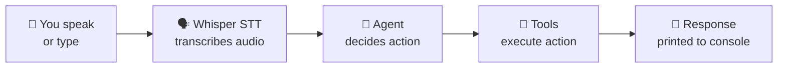
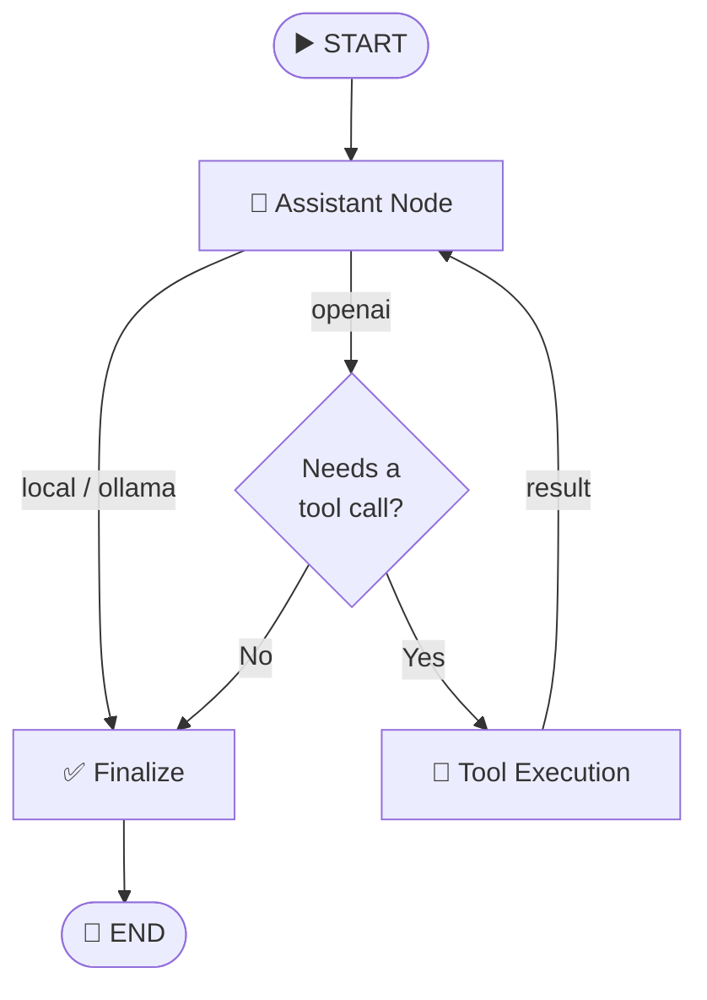
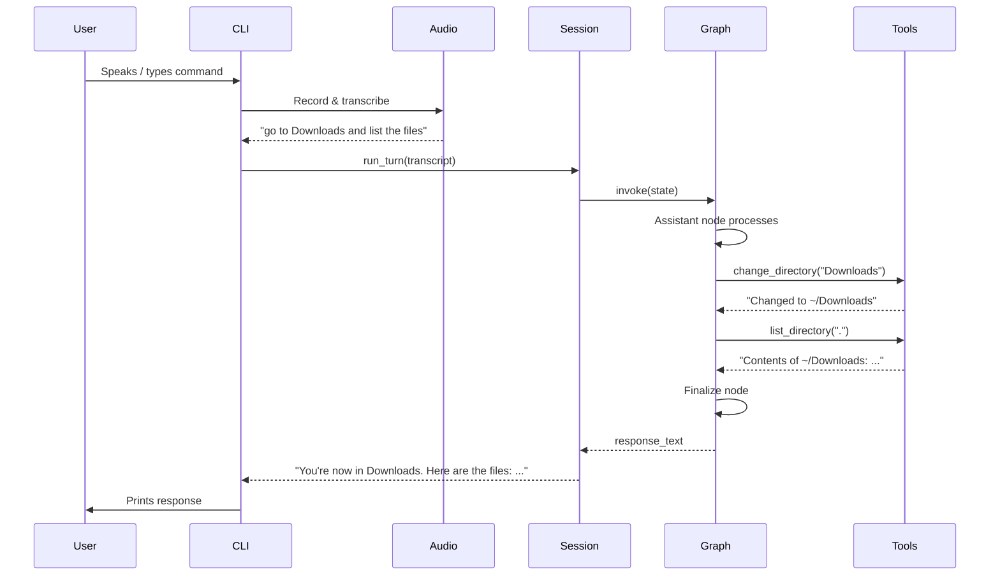

# Architecture Overview

A visual guide to how the **LangGraph Voice File Agent** works — from voice input to spoken response.

---

## How It Works (Big Picture)



**In one sentence:** You give a voice or text command → the agent figures out what to do → executes filesystem/app actions → tells you the result.

---

## Agent Flow (LangGraph State Machine)

The core agent is a **LangGraph `StateGraph`** that routes through different nodes depending on the configured model provider.



### Provider Modes

| Provider | Description | Needs Internet? |
|----------|-------------|:---:|
| `local` | Rule-based regex matching — no LLM, instant responses | ❌ |
| `ollama` | Local LLM (e.g. Llama 3.1) generates a JSON action plan, executes it, then writes a natural reply | ❌ |
| `openai` | OpenAI GPT with LangChain tool-calling — the LLM can call tools in a loop until it has enough info | ✅ |

Set via `MODEL_PROVIDER` in your `.env` file.

---

## Available Tools

These are the actions the agent can perform:

| Tool | Description |
|------|-------------|
| `get_current_directory` | Show where you are right now |
| `change_directory` | Navigate to a folder (must be within allowed roots) |
| `list_directory` | List files and folders in a directory |
| `read_file` | Read contents of a text file (up to 4000 chars) |
| `search_files` | Search for files/folders by name (up to 25 results) |
| `open_application` | Launch an installed app (VS Code, Firefox, Terminal, etc.) |
| `open_file` | Open a file with its default system viewer (`xdg-open`) |

---

## Module Map

```
voice_agent/
│
├── cli.py                  ← Entry point — Typer CLI commands
├── audio.py                ← Mic recording, Whisper STT, speaker output
├── config.py               ← Settings loaded from .env
├── session.py              ← Conversation session (keeps history across turns)
│
├── graph.py                ← LangGraph state machine (the "brain")
├── state.py                ← Shared typed state definition
├── prompts.py              ← System prompt builder
│
├── local_agent.py          ← Offline regex-based command parser
├── llm_filesystem_agent.py ← Ollama plan → execute → respond pipeline
├── llm.py                  ← LLM factory (OpenAI / Ollama)
│
├── tools.py                ← LangChain tool definitions
├── filesystem.py           ← Path resolution & sandbox enforcement
└── launcher.py             ← App launching & xdg-open integration
```

### How modules connect

```mermaid
flowchart TD
    cli["cli.py"] --> audio["audio.py"]
    cli --> session["session.py"]
    session --> graph["graph.py"]

    graph --> local["local_agent.py"]
    graph --> llm_fs["llm_filesystem_agent.py"]
    graph --> tools["tools.py"]

    local --> fs["filesystem.py"]
    local --> launcher["launcher.py"]
    llm_fs --> fs
    llm_fs --> launcher
    tools --> fs
    tools --> launcher

    graph --> llm["llm.py"]
    llm_fs --> llm
    graph --> prompts["prompts.py"]

    config["config.py"] -.->|"used everywhere"| cli
```

---

## Conversation Turn Lifecycle

Here's what happens during a single turn (e.g. you say "go to Downloads and list the files"):



---

## Security Model

```
┌──────────────────────────────────────────┐
│            Allowed Roots                 │
│  (configured via ALLOWED_ROOTS in .env)  │
│                                          │
│   ~/Downloads/  ~/Documents/  ./         │
│       ✅ READ        ✅ READ    ✅ READ   │
│       ❌ WRITE       ❌ WRITE   ❌ WRITE  │
│                                          │
│   /etc/  /usr/  ~/secrets/               │
│       🚫 BLOCKED     🚫 BLOCKED          │
└──────────────────────────────────────────┘
```

- **Read-only** — no write, delete, rename, or move operations
- **Sandboxed** — all paths must resolve inside `ALLOWED_ROOTS`
- Paths outside allowed roots throw `FileAccessError`

---

## Example Commands

| What you say | What happens |
|---|---|
| *"Go to Downloads"* | Changes current directory to `~/Downloads` |
| *"List the files here"* | Lists files in the current directory |
| *"Read README.md"* | Displays contents of `README.md` |
| *"Search for .py files"* | Finds files with `.py` in the name |
| *"Open VS Code"* | Launches Visual Studio Code |
| *"Open report.pdf"* | Opens the PDF in default viewer |
| *"Where am I?"* | Reports the current directory |
